# 🎓 Student Registration — Azure DevSecOps

A full-stack **Student Registration** application (React + Spring Boot + MariaDB) built primarily as an end-to-end **DevSecOps reference project** on Microsoft Azure — covering Infrastructure as Code, containerization, CI with security gates, GitOps continuous delivery to Kubernetes, and full observability.

> Infra → CI → Security Scan → Registry → GitOps CD → AKS → Monitoring, all wired together.

<p align="left">
  
  
  
  
  
  
  
  
  
  
  
  
  
  
</p>

---

## 📖 Table of Contents

- [Overview](#-overview)
- [Architecture](#-architecture)
- [Tech Stack](#-tech-stack)
- [Features](#-features)
- [API Reference](#-api-reference)
- [Repository Structure](#-repository-structure)
- [Getting Started (Local Development)](#-getting-started-local-development)
- [Running with Docker](#-running-with-docker)
- [Infrastructure as Code — Terraform](#1%EF%B8%8F%E2%83%A3-infrastructure-as-code--terraform)
- [CI Pipeline — Jenkins + Trivy](#2%EF%B8%8F%E2%83%A3-ci-pipeline--jenkins--trivy)
- [Container Registry — Docker Hub](#3%EF%B8%8F%E2%83%A3-container-registry--docker-hub)
- [Deployment — Helm on AKS](#4%EF%B8%8F%E2%83%A3-deployment--helm-on-aks)
- [GitOps CD — Argo CD](#5%EF%B8%8F%E2%83%A3-gitops-cd--argo-cd)
- [Observability — Azure Monitor, Managed Prometheus & Grafana](#6%EF%B8%8F%E2%83%A3-observability--azure-monitor-managed-prometheus--grafana)
- [Security Practices](#-security-practices)
- [Roadmap](#-roadmap)
- [Author](#-author)

---

## 🧭 Overview

This project simulates a real production workflow for a small internal web application:

1. A **React** frontend lets a user register students and view/delete records in a table.
2. A **Spring Boot** REST API persists data to **MariaDB**.
3. Every push to `main` runs through a **Jenkins** pipeline that tests, builds, **scans images with Trivy**, and publishes to **Docker Hub**.
4. Jenkins then updates image tags on a dedicated `gitops` branch (Helm `values.yaml`), which **Argo CD** picks up automatically and syncs to an **Azure Kubernetes Service (AKS)** cluster.
5. The cluster is provisioned with **Terraform** (VMs) and Azure CLI (AKS), and is fully observable through **Azure Monitor's managed Prometheus** and **Azure Managed Grafana** dashboards.

In short: this repo is less about the CRUD app itself, and more a demonstration of a secure, automated, GitOps-driven delivery pipeline on Azure.

---

## 🏗 Architecture

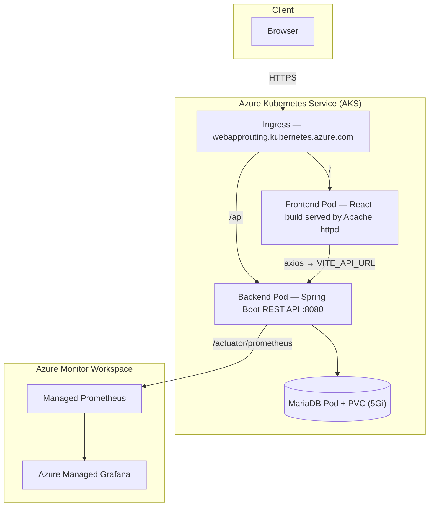

### Delivery pipeline

```mermaid
flowchart LR
    DEV[Developer Commit] --> GH["GitHub (main branch)"]
    GH --> JK["Jenkins Pipeline"]
    JK --> T1["Backend: mvn test"]
    JK --> T2["Frontend: npm lint"]
    T1 --> BLD["Docker build: frontend + backend"]
    T2 --> BLD
    BLD --> SCAN["Trivy scan (vuln + secret, HIGH/CRITICAL)"]
    SCAN -->|pass| PUSH["Push images to Docker Hub"]
    PUSH --> GITOPS["Update helm/values.yaml on 'gitops' branch"]
    GITOPS --> ARGO["Argo CD auto-detects change"]
    ARGO --> SYNC["Sync to AKS via Helm chart"]
    SYNC --> MON["Azure Managed Prometheus + Grafana"]
```

---

## 🧰 Tech Stack

| Layer | Technology |
|---|---|
| **Frontend** | React 18, Vite, Axios, React Router DOM |
| **Backend** | Java 17, Spring Boot 3.5, Spring Data JPA, Spring Actuator, Micrometer (Prometheus registry), Lombok |
| **Database** | MariaDB 11.8 |
| **Containers** | Docker (multi-stage builds), non-root runtime users |
| **CI** | Jenkins Declarative Pipeline |
| **Security scanning** | Trivy (vulnerability + secret scanning), SonarQube Maven plugin |
| **IaC** | Terraform (`azurerm` provider) for Azure VM infrastructure |
| **Container Orchestration** | Kubernetes on Azure Kubernetes Service (AKS) |
| **Packaging** | Helm chart (`helm/student-registration`) |
| **GitOps CD** | Argo CD |
| **Observability** | Azure Monitor Workspace, Azure Managed Prometheus, Azure Managed Grafana, Spring Boot Actuator |
| **Registry** | Docker Hub |

---

## ✨ Features

- 📝 Register a student with name, email, course, highest education, percentage, branch/stream, and mobile number
- 📋 View all registered students in a live table
- 🗑 Delete a student record
- ❤️ Health checks via Spring Boot Actuator (`/actuator/health`, `/actuator/prometheus`)
- 🔐 Every image is vulnerability- and secret-scanned before it is allowed to ship
- 🔁 Fully automated GitOps delivery — no manual `kubectl apply` to production
- 📊 Real-time application and infrastructure metrics on Grafana

---

## 🔌 API Reference

Base path: `/api` (proxied by the ingress to the backend service on port `8080`)

| Method | Endpoint | Description |
|---|---|---|
| `POST` | `/api/register` | Register a new student |
| `GET` | `/api/users` | List all registered students |
| `DELETE` | `/api/users/{id}` | Delete a student by ID |
| `GET` | `/actuator/health` | Liveness / readiness probe target |
| `GET` | `/actuator/prometheus` | Prometheus scrape endpoint |

---

## 📁 Repository Structure

```
Student_Registration-Azure-DevSecOps/
├── backend/                       # Spring Boot REST API
│   ├── src/main/java/.../controller/UserController.java
│   ├── src/main/java/.../model/User.java
│   ├── src/main/java/.../repository/UserRepository.java
│   ├── src/main/resources/application.properties
│   ├── Dockerfile                 # Multi-stage: maven build -> eclipse-temurin JRE (alpine)
│   └── pom.xml
├── frontend/                      # React + Vite SPA
│   ├── src/components/RegistrationForm.jsx
│   ├── src/hooks/useRegistrationForm.js
│   ├── src/api/userService.js
│   ├── Dockerfile                 # Multi-stage: node build -> httpd:alpine
│   └── package.json
├── helm/student-registration/     # Helm chart deployed to AKS by Argo CD
│   ├── Chart.yaml
│   ├── values.yaml                # Image tags updated automatically by Jenkins
│   └── templates/
│       ├── backend.yaml
│       ├── frontend.yaml
│       ├── mariadb.yaml
│       ├── ingress.yaml
│       └── servicemonitor.yaml    # Scraped by Azure Managed Prometheus
├── terraform/vm1_terraform_setup/ # Provisions the DevOps + K8s VMs on Azure
│   ├── provider.tf / versions.tf
│   ├── resource-group.tf / network.tf
│   ├── vm-devops.tf / vm-k8s.tf
│   └── variables.tf / outputs.tf
├── Jenkinsfile                    # Full CI pipeline definition
└── Screenshots/                   # Evidence captures used in this README
```

---

## 💻 Getting Started (Local Development)

### Prerequisites
- Java 17 (JDK) & Maven
- Node.js & npm
- A running MariaDB instance

### Backend

```bash
cd backend

# Configure your database in src/main/resources/application.properties
# (or export as environment variables consumed by the properties file)
export DB_HOST=localhost
export DB_PORT=3306
export DB_NAME=student_registration
export DB_USER=root
export DB_PASSWORD=yourpassword

mvn clean package
java -jar target/student-registration-backend-0.0.1-SNAPSHOT.jar
```
The API starts on **http://localhost:8080**.

### Frontend

```bash
cd frontend
npm install

# point the SPA at your backend
echo 'VITE_API_URL="http://localhost:8080/api"' > .env

npm run dev       # development server
# or
npm run build     # production build -> dist/
```

---

## 🐳 Running with Docker

```bash
# Backend
docker build -t student-registration-backend ./backend
docker run -p 8080:8080 \
  -e DB_HOST=<db-host> -e DB_PORT=3306 \
  -e DB_NAME=student_registration -e DB_USER=<user> -e DB_PASSWORD=<pass> \
  student-registration-backend

# Frontend
docker build --build-arg VITE_API_URL=/api -t student-registration-frontend ./frontend
docker run -p 80:80 student-registration-frontend
```

---

## 1️⃣ Infrastructure as Code — Terraform

Two Ubuntu 24.04 LTS VMs (a **DevOps VM** for Jenkins/Docker/Trivy, and a **Kubernetes VM** with `k3s`, `kubectl`, `helm`, and the Azure CLI pre-validated) are provisioned in a dedicated VNet/Subnet with per-role NSGs (SSH, Jenkins `8080`, HTTP/HTTPS, Grafana `3000`). The production-facing workload itself runs on a separately provisioned **AKS** cluster.

<table>
<tr>
<td width="33%"><br/><sub align="center">Terraform <code>apply</code> — 13 resources created (VNet, NSGs, NICs, both VMs)</sub></td>
<td width="33%">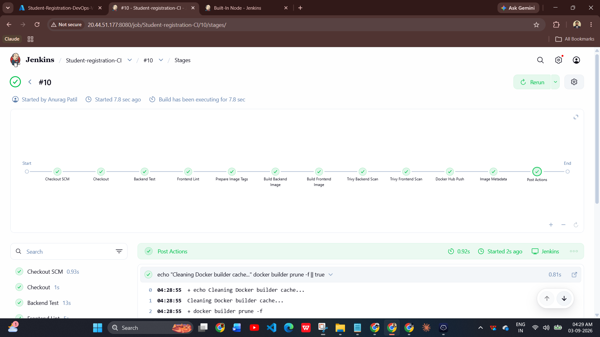<br/><sub>DevOps VM provisioned and reachable</sub></td>
<td width="33%"><br/><sub>K8s VM toolchain validated: Azure CLI, Terraform, kubectl, Helm, Git</sub></td>
</tr>
</table>

<table>
<tr>
<td width="50%">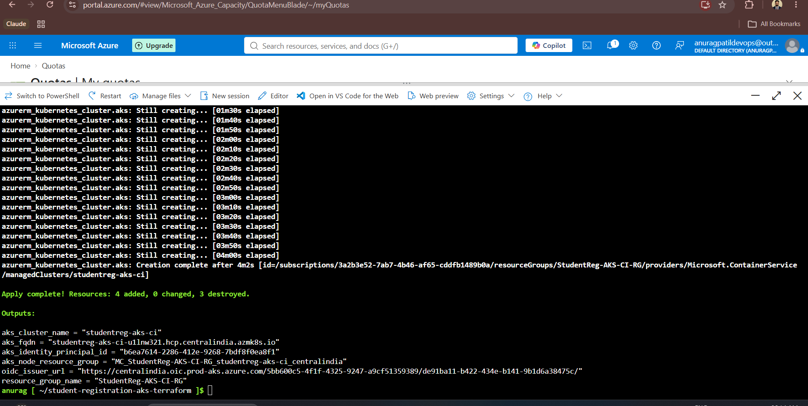<br/><sub>AKS cluster <code>studentreg-aks-ci</code> created</sub></td>
<td width="50%"><br/><sub>Resulting Azure resource groups: infra VMs, AKS cluster, and its managed node RG</sub></td>
</tr>
</table>

---

## 2️⃣ CI Pipeline — Jenkins + Trivy

The [`Jenkinsfile`](./Jenkinsfile) defines a declarative pipeline with these stages:

`Checkout` → `Backend Test (mvn test)` → `Frontend Lint (npm lint)` → `Prepare Image Tags` → `Build Backend Image` → `Build Frontend Image` → `Trivy Backend Scan` → `Trivy Frontend Scan` → `Docker Hub Push` → `Update GitOps Image Tags` → `Image Metadata`

Images are tagged with `<git-sha>-<build-number>` for full traceability, and the pipeline **fails the build (`exit-code 1`) on any `HIGH`/`CRITICAL` Trivy finding**, so a vulnerable image never reaches Docker Hub.

<p align="center">
  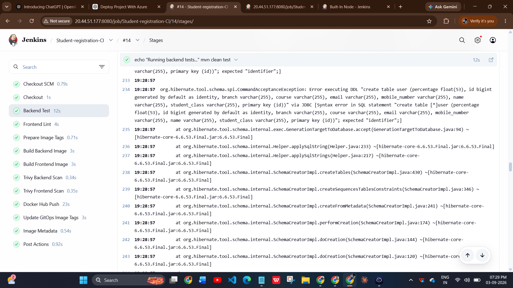
  <br/><sub>A completed pipeline run — every stage, including both Trivy scans, passing</sub>
</p>

---

## 3️⃣ Container Registry — Docker Hub

On a successful `main` build, both images are pushed with two tags (`<sha>-<build>` and `<sha>`) to Docker Hub.

<p align="center">
  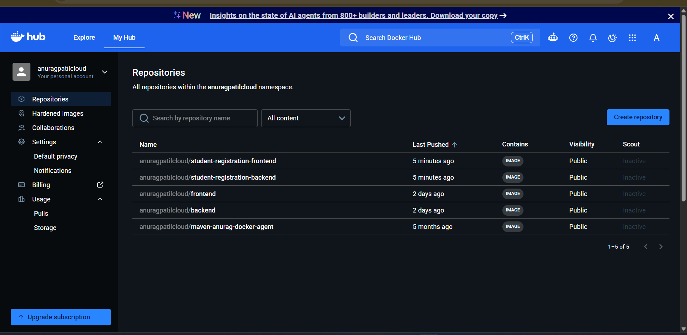
  <br/><sub><code>student-registration-frontend</code> and <code>student-registration-backend</code> freshly published</sub>
</p>

---

## 4️⃣ Deployment — Helm on AKS

The [`helm/student-registration`](./helm/student-registration) chart deploys the frontend, backend, and MariaDB (with a `PersistentVolumeClaim`), an `Ingress` using AKS's built-in **Web Application Routing** add-on, and a `ServiceMonitor` for Prometheus scraping — all templated from a single [`values.yaml`](./helm/student-registration/values.yaml).

<p align="center">
  
  <br/><sub>Pods <code>Running</code> on AKS; ingress reachable; <code>/actuator/health</code> reporting <code>UP</code> for DB, disk space, liveness & readiness</sub>
</p>

---

## 5️⃣ GitOps CD — Argo CD

Jenkins never talks to the cluster directly. Instead, its final stage commits the new image tags to `helm/values.yaml` on a dedicated **`gitops`** branch. An Argo CD `Application` watches that branch/path and **auto-syncs** the cluster to match — a clean separation between "build" (Jenkins/CI) and "release" (Argo CD/CD).

<table>
<tr>
<td width="50%"><br/><sub>The <code>student-registration</code> Argo CD Application, tracking the <code>gitops</code> branch</sub></td>
<td width="50%">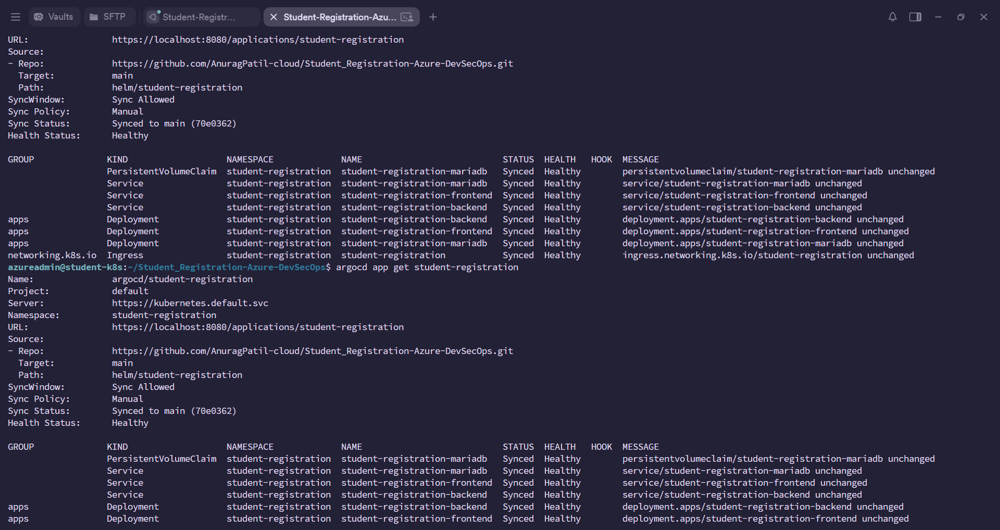<br/><sub>Automated sync policy enabled — no manual promotion step</sub></td>
</tr>
</table>

<p align="center">
  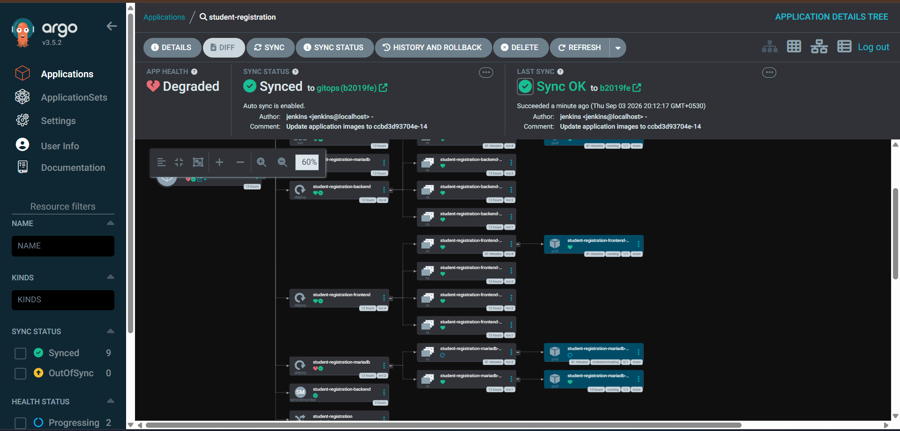
  <br/><sub>Full resource tree: Deployments → ReplicaSets → Pods for frontend, backend, and MariaDB, all <code>Synced</code></sub>
</p>

---

## 6️⃣ Observability — Azure Monitor, Managed Prometheus & Grafana

An **Azure Monitor Workspace** collects cluster and application metrics via **Azure Managed Prometheus** (enabled with `az aks update --enable-azure-monitor-metrics`), which is then wired into **Azure Managed Grafana** as a data source, with RBAC access granted via Azure role assignment.

<table>
<tr>
<td width="33%">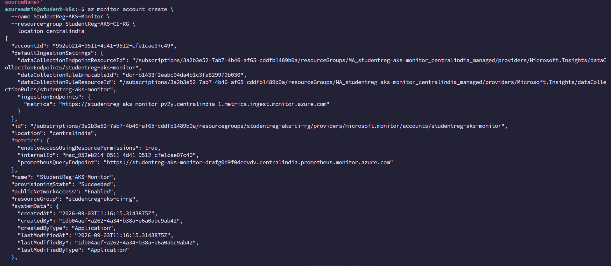<br/><sub>Azure Monitor Workspace created</sub></td>
<td width="33%"><br/><sub>Managed Prometheus enabled on the AKS cluster</sub></td>
<td width="33%">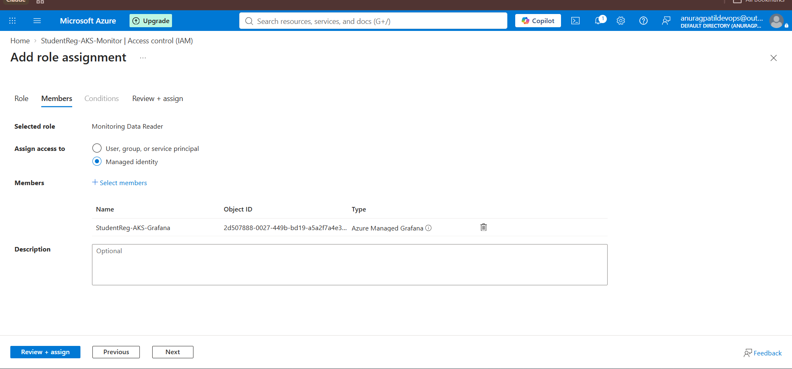<br/><sub>Role assignment granted to Azure Managed Grafana</sub></td>
</tr>
<tr>
<td width="33%">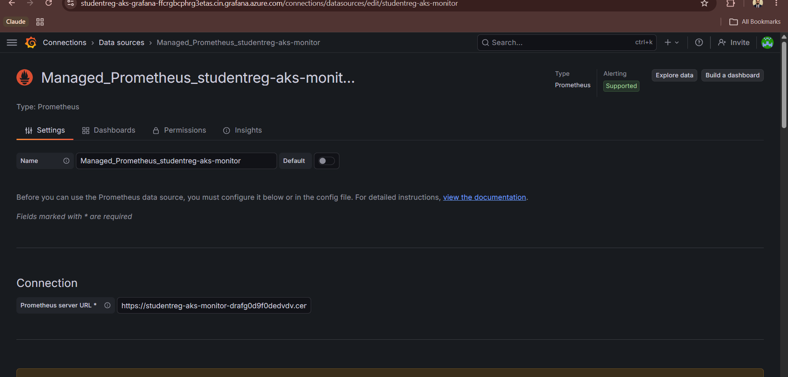<br/><sub>Managed Prometheus wired in as a Grafana data source</sub></td>
<td width="33%">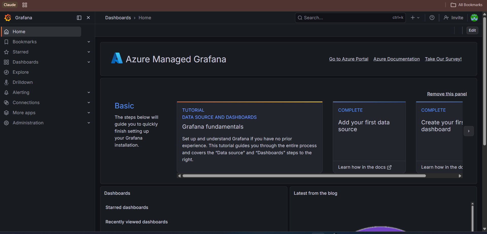<br/><sub>Azure Managed Grafana workspace, ready for dashboards</sub></td>
<td width="33%">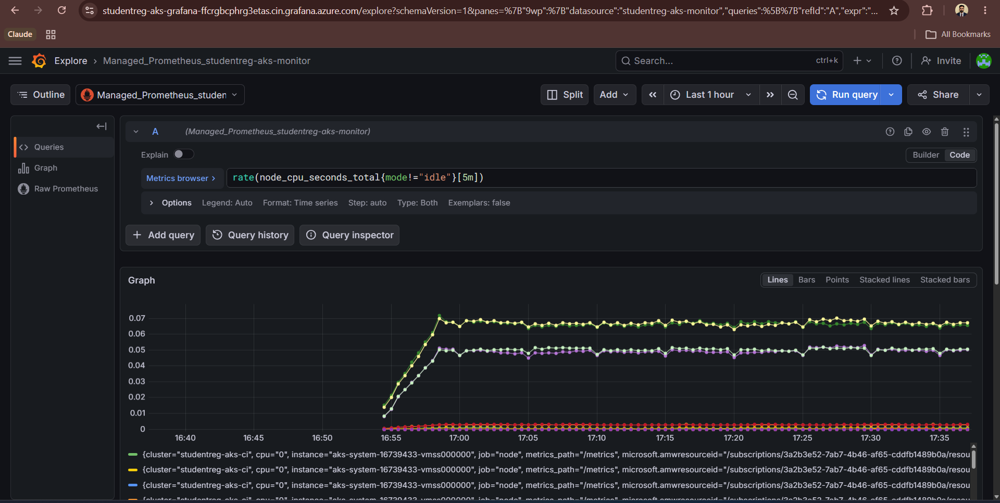<br/><sub>Cluster-level node CPU (<code>node_cpu_seconds_total</code>)</sub></td>
</tr>
</table>

**Application & infrastructure metrics dashboarded (PromQL shown in each panel):**

<table>
<tr>
<td width="33%">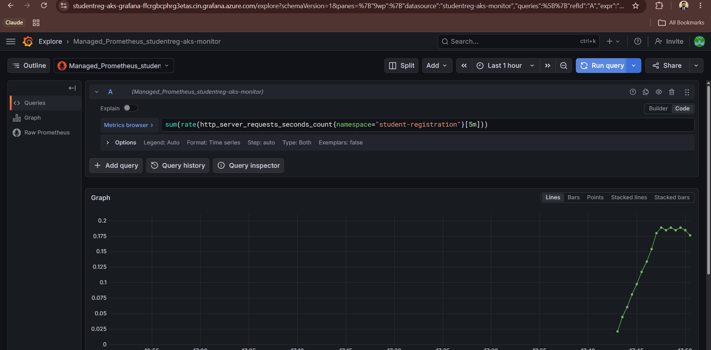<br/><sub>HTTP request rate<br/><code>sum(rate(http_server_requests_seconds_count[5m]))</code></sub></td>
<td width="33%">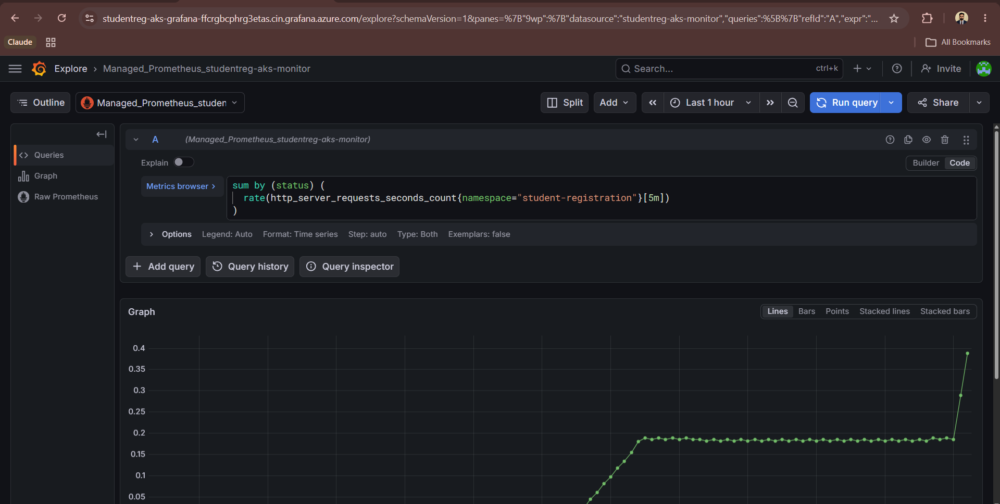<br/><sub>HTTP status code distribution</sub></td>
<td width="33%">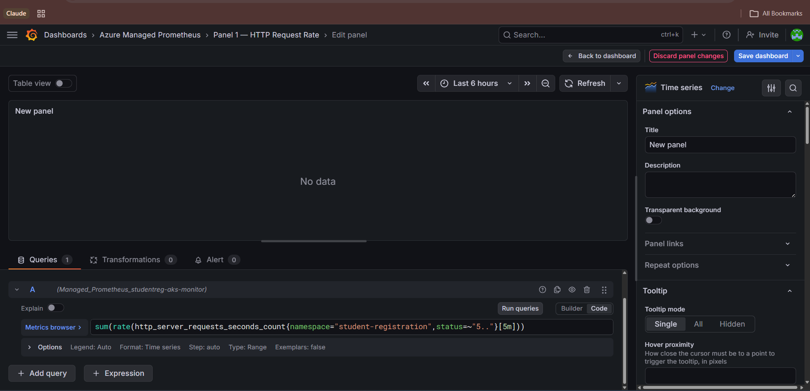<br/><sub>HTTP 5xx error rate (clean — zero server errors)</sub></td>
</tr>
<tr>
<td width="33%">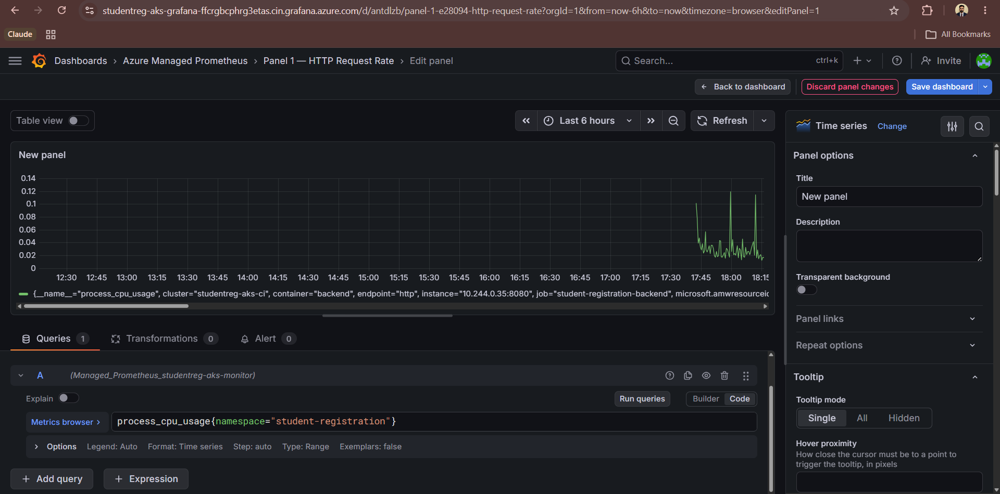<br/><sub>Backend JVM process CPU usage</sub></td>
<td width="33%">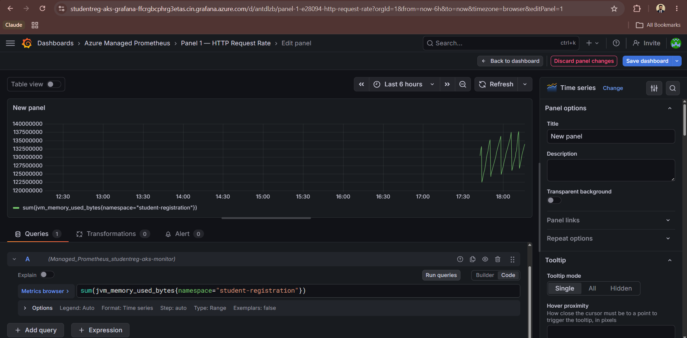<br/><sub>JVM memory used (<code>jvm_memory_used_bytes</code>)</sub></td>
<td width="33%">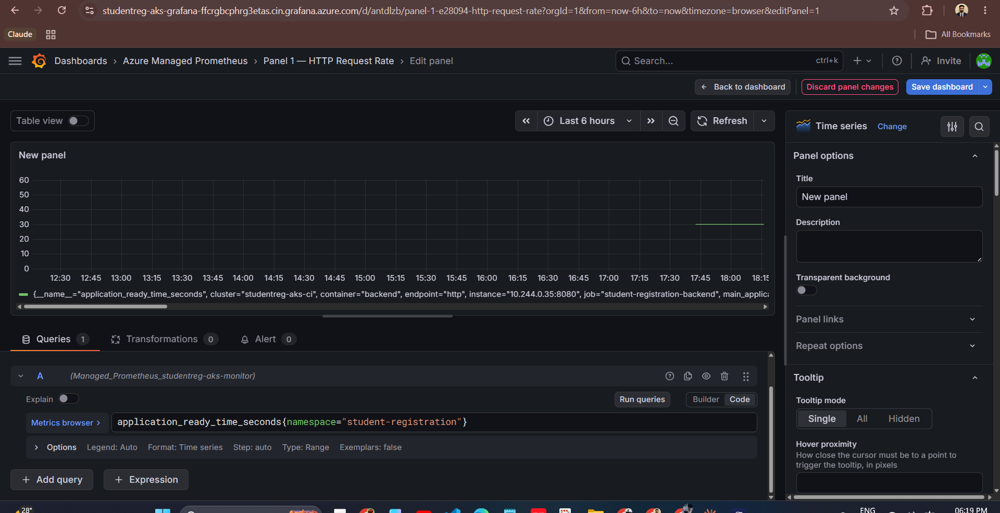<br/><sub>Spring Boot application ready time</sub></td>
</tr>
<tr>
<td width="33%">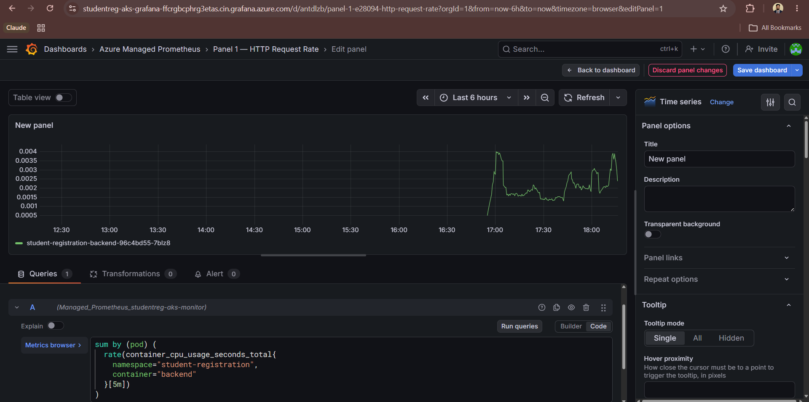<br/><sub>Backend pod CPU (<code>container_cpu_usage_seconds_total</code>)</sub></td>
<td width="33%">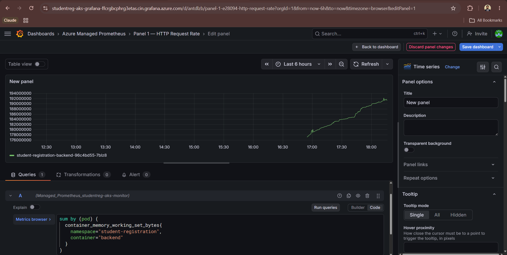<br/><sub>Backend pod memory (<code>container_memory_working_set_bytes</code>)</sub></td>
<td width="33%"></td>
</tr>
</table>

---

## 🔐 Security Practices

- **Least-trust runtime images** — backend runs as a non-root `spring` user on `eclipse-temurin-jre-alpine`; frontend serves static assets from `httpd:alpine` with Alpine packages patched at build time.
- **Shift-left scanning** — Trivy scans both application images for OS/library vulnerabilities *and* leaked secrets on every build, gated at `HIGH`/`CRITICAL` severity with a hard pipeline failure.
- **Static analysis** — SonarQube Maven plugin wired into the backend build.
- **No direct cluster access from CI** — Jenkins can only push a Git commit; Argo CD is the only actor that talks to the Kubernetes API, reducing the CI system's blast radius.
- **Secrets via Kubernetes Secrets** — DB credentials are injected into the backend via `secretKeyRef`, never baked into images or Helm values.

---

## 🗺 Roadmap

- [ ] Add automated frontend/backend unit test coverage reporting
- [ ] Promote the SonarQube stage into the active Jenkins pipeline
- [ ] TLS termination on the ingress (cert-manager / Let's Encrypt)
- [ ] Horizontal Pod Autoscaling based on the custom Prometheus metrics already collected
- [ ] Multi-environment GitOps (`staging` / `production` overlays)

---

## 👤 Author

**Anurag Patil**
GitHub: [@AnuragPatil-cloud](https://github.com/AnuragPatil-cloud) · Docker Hub: [anuragpatilcloud](https://hub.docker.com/u/anuragpatilcloud)
